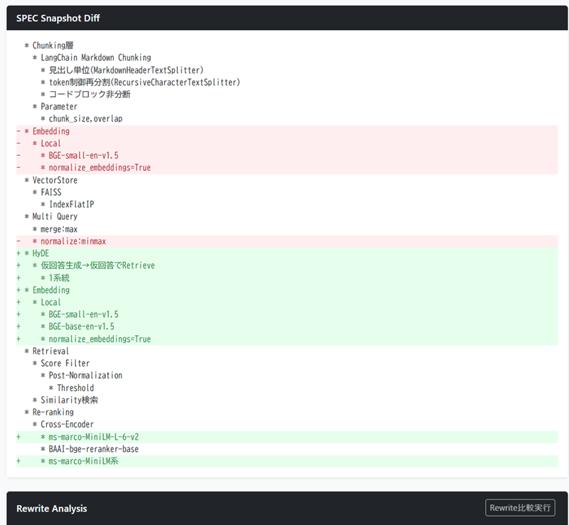
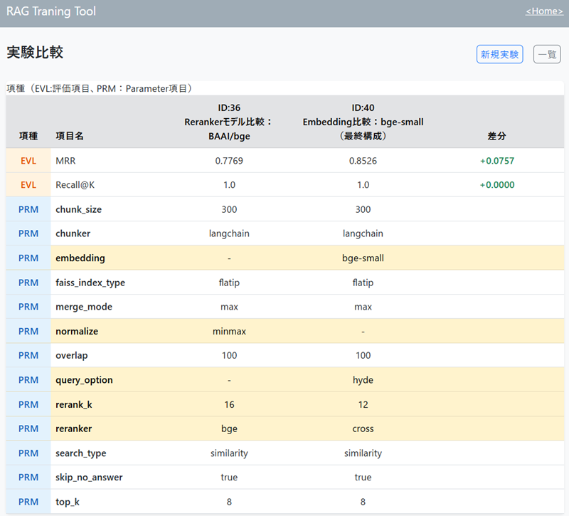

# RAG実験管理ツール（rag_tr_tool）

RAGパイプラインのパラメータを変えながら検索精度を測定し、結果を記録・比較するためのDjango製の実験管理ツールです。

## コンセプト
RAG開発のプロセス把握や記録作業を容易にするとともに、効率的な学習ツールになる事を意図して次の機能を実現する。
- 一連の実験記録を自動保存して見やすく管理でき、任意の２つの実験結果やパラメータを容易に比較できること
- パイプライン構成や設定値を簡単に変更、再利用できるよう、シンプルな書式のテキストでパラメータ設定できること
- パイプライン構成を、構造的にも分かりやすく字下げした一覧で表示し、スナップショットとして記録もできること
- スナップショットは実行時点のソースコードから生成し、コードを変更した後でも、過去の実験と紐づけ（追跡）できること

---

## 測定フォーカス

測定対象は**検索（Retrieval）の精度のみ**です。LLMの回答品質は測りません。

```
質問 ──▶ [検索] ──▶ 関連しそうな文書チャンク ──▶ [LLM] ──▶ 回答
          ↑                                        ↑
     ここを測る                              ここは測らない
   （MRR / Recall@K）                    （回答生成は目視確認用のおまけ）
```

| 指標 | 定義 | 読み方 |
|---|---|---|
| **MRR** | 正解が最初に現れた順位の逆数の平均（1位=1.0 / 2位=0.5 / 圏外=0.0） | 正解をどれだけ**上位に置けたか** |
| **Recall@K** | 上位K件に正解が1つでも入っていれば1、なければ0。その平均 | そもそも**拾えたか** |

MRRが低くRecall@Kが高ければ「拾えてはいるが上位に持ってこられていない」＝ Re-ranker が効く可能性がある、といった読み方をします。

評価対象コーパス：開発用として **FastAPI 公式ドキュメント（Markdown）** を使用。現在、プロジェクト毎に任意の文書コーパス対応に修正中。

---

## 主な機能

### 実験の記録と比較

- 1回の実験＝1レコード。パラメータ・MRR・Recall@K・検索ログ・SPECスナップショットを保存
- 一覧はクエリ数 → MRR → Recall@K → ID の優先順でソート。最新3件には `New` / `1st` / `2nd` バッジ
- 2実験を選んで比較画面へ。**パラメータ差分・スコア差分・パイプライン構成差分**を並べて表示
- タイトル・スコア・パラメータをワンクリックでクリップボードにコピー（実験メモをそのまま外部に貼れる）
- プロジェクト単位で実験をグルーピング

### パラメータのテキスト化

パラメータは画面のテキスト欄で編集します。フォーム部品を並べるのではなくテキストにすることで、**前回の設定をコピーして1箇所だけ書き換える**といった操作が容易になります。

保存・表示される形式（一覧画面）:

```
chunk_size: 500, overlap: 100, chunker: langchain, faiss_index_type: flatip,
top_k: 5, search_type: hybrid, fetch_k: 20, rrf_k: 60
```

表示順はパイプラインの処理順（Chunking → VectorStore → Retrieval → …）に固定されており、どの段階の設定かが並びから読み取れます。

ブラウザ側で以下を自動処理します。

| 機能 | 内容 |
|---|---|
| 既定値の補完 | 未入力のキーを自動挿入 |
| 条件付き補完 | `search_type: mmr` なら `fetch_k` / `lambda_mult` を挿入、など |
| 不要パラメータ検出 | `search_type: mmr` なのに `rrf_k` が残っていればエラー |
| 許容値・型チェック | エラーは全件まとめて表示 |
| 旧パラメータ名の検出 | リネーム前の名前を使っていれば警告 |

### パイプライン構成の可視化とスナップショット

ソースコード中の `# SPEC:` コメントを走査し、**そのパラメータで実際に有効になる構成だけ**を字下げツリーで表示します。実験実行時にはこのツリーが `spec_snapshot` として保存されます。

`search_type: hybrid` を指定した場合の出力例:

```
* Embedding
  * Local
    * BGE-small-en-v1.5
    * normalize_embeddings=True
* VectorStore
  * FAISS
    * IndexFlatIP
  * BM25
    * BM25Okapi(rank-bm25)
      * 空白トークナイズ
* Chunking層
  * LangChain Markdown Chunking
    * 見出し単位(MarkdownHeaderTextSplitter)
    * token制御再分割(RecursiveCharacterTextSplitter)
    * コードブロック非分断
  * Parameter
    * chunk_size,overlap
* Retrieval
  * Score Filter
    * Post-Normalization
      * Threshold
  * Hybrid Search
    * BM25+Vector
      * RRF
```

`query_option: multi` と `reranker: cross` を追加すると、構成に応じてツリーが変化します:

```
* Multi Query
  * merge:max
  * normalize:minmax
  * gate:top1
  * Gate Score
    * Pre-Normalization(Raw)
* Retrieval
  * Score Filter
    * Post-Normalization
      * Threshold
  * Similarity検索
* Re-ranking
  * Cross-Encoder
    * ms-marco-MiniLM系
```

`VectorStore` から `BM25` が消え、`Multi Query` と `Re-ranking` が現れている点に注目してください。**手で書いた図ではなく、実際に走るコードから生成されています。** そのため図と実装が乖離しません。

比較画面ではこのツリー同士を行単位で差分表示するため、「2つの実験でパイプラインのどこが違ったのか」が一目で分かります。



赤（`-`）が削除、緑（`+`）が追加。上図は `query_option` を `hyde` に、`reranker` を `cross` に変えた場合の差分で、`HyDE` の系統と `ms-marco-MiniLM-L-6-v2` が加わり、`Multi Query` 配下の `normalize:minmax` が外れたことが読み取れます。パラメータ値の差分（前掲の比較画面）が「何を変えたか」を示すのに対し、こちらは**その変更でパイプラインの構造がどう変わったか**を示します。

### インデックスのキャッシュ

インデックス構築（数千チャンクのCPU推論）は数分かかります。本ツールは**インデックスの中身に影響するパラメータのみ**をハッシュ化してディレクトリ名にし、同一設定なら再利用します。

```python
_INDEX_PARAM_KEYS = {"chunk_size", "overlap", "chunker", "faiss_index_type"}
```

`search_type` をハッシュに含めないのは意図的です。`similarity` / `hybrid` / `bm25` が**同一のチャンク集合・同一のEmbedding**を共有することで、検索方式だけを変えた公正な比較ができます。

---

## 対応パイプライン

| 段階 | 選択肢 |
|---|---|
| **Chunking** | `langchain`（MarkdownHeaderTextSplitter + RecursiveCharacterTextSplitter）/ `legacy`（自前の構造保存型） |
| **Embedding** | `BAAI/bge-small-en-v1.5`（ローカル・CPU） |
| **VectorStore** | FAISS `IndexFlatIP` / `IndexFlatL2`、BM25（`rank-bm25`） |
| **Retrieval** | `similarity` / `mmr` / `bm25` / `hybrid`（BM25+Vector を RRF 統合） |
| **クエリ加工** | Query Rewrite / Multi Query（＋ゲーティング・スコア統合・正規化） |
| **Re-ranking** | Cross-Encoder（`ms-marco-MiniLM-L-6-v2`） |
| **フィルタ** | スコア閾値（正規化後）・候補数制御 |

---

## 動作環境

| 項目 | 内容 |
|---|---|
| OS | WSL2（Ubuntu 24）で開発・動作確認 |
| Python | 3.12 |
| フレームワーク | Django 5.1 |
| DB | PostgreSQL |
| GPU | 不要（**CPU推論のみで動作**。Intel Iris Xe / CUDA不可の環境で開発） |

主要パッケージ: `sentence-transformers` / `faiss` / `langchain-text-splitters` / `rank-bm25` / `numpy`

外部API: OpenAI `gpt-4.1-mini`（Query Rewrite / Multi Query / LLM回答生成でのみ使用。**使わなければAPIキーは不要**）

---

## セットアップ

### 1. 依存パッケージ

```bash
python -m venv .venv
source .venv/bin/activate
pip install -r requirements.txt
```

### 2. データベース

```bash
python manage.py migrate
```

> マイグレーション `0004` がデフォルトプロジェクト（`id=1`）を作成します。`Experiment.project` の `default=1` はこのレコードの存在が前提のため、スキップしないでください。

### 3. 評価対象コーパスの配置

Markdown のコーパスを以下に配置します（**リポジトリには含まれません**）。開発用には FastAPI 公式ドキュメントを使用しています。

```
data/rag_tr_tool/raw/fastapi/docs/**/*.md
```

<!-- TODO: 取得手順（git clone のURL・対象パス・推奨コミット）を記載 -->

> 現在このパスは固定で、全プロジェクトが同一コーパスを参照します。**プロジェクト毎に任意の文書コーパスを扱えるよう修正中**です。

### 4. OpenAI APIキーの設定（任意）

Query Rewrite / Multi Query / LLM回答生成を使う場合のみ必要です。

<!-- TODO: 環境変数方式へ移行予定 -->

> **⚠ 現在の実装は `app/rag_tr_tool/config.json` にAPIキーを平文で記載します。**
> **デモで動作確認をする場合は取り扱いに十分ご注意ください。**

### 5. 起動

```bash
python manage.py runserver
```

ブラウザで `/rag/` を開きます。

---

## 使い方

```
① /rag/projects/ でプロジェクトを作成
        ↓
② data/rag_tr_tool/pj_{id}/evaluation_queries.json に評価クエリを記述
        ↓
③ 「新規実験」でパラメータを入力 → Run
        ↓
④ result画面でスコア・検索ログ・SPECを確認
        ↓
⑤ 一覧から2件選んで「比較」
```

⑤の比較画面。スコア（EVL）とパラメータ（PRM）を2実験ぶん並べ、**値が異なる行だけをハイライト**します。



この例では、Reranker を `bge` → `cross` に変え、あわせて `query_option: hyde` と `embedding: bge-small` を加えた結果、MRR が **0.7769 → 0.8526（+0.0757）** に改善しています。差分行だけを追えば「何を変えたか」が分かり、上段の EVL 行で「その結果どうなったか」が分かる構成です。

### 評価クエリの記述

プロジェクト作成時に空配列 `[]` のファイルが自動生成されます。**実験前に必ず編集してください**（空のままだと評価件数0で MRR=0.0 になります）。

```json
[
  {
    "query": "How do I define a path parameter with a type?",
    "relevant_sources": ["tutorial/path-params.md"]
  },
  {
    "query": "How to return a custom status code?",
    "relevant_sources": [
      "tutorial/response-status-code.md",
      "advanced/response-change-status-code.md"
    ]
  }
]
```

`relevant_sources` は**コーパスルートからの相対パス**で記述します。この値が正解データそのものであり、測定精度はこの定義の質に依存します。

---

## ディレクトリ構成

```
app/rag_tr_tool/
├── web/          Djangoアプリ（views / models / services）
├── core/         RAGパイプライン本体（ingest / chunking / embedding /
│                 vectorstore / indexing / retrieval / rewrite / llm / evaluation）
├── utils/        SPEC抽出・ログ整形・データ入出力
└── config.json   設定（※APIキーを含む。コミット禁止）

data/rag_tr_tool/
├── raw/fastapi/docs/     評価対象コーパス（現在は全プロジェクト共通・パス固定）
└── pj_{id}/              プロジェクト別
    ├── evaluation_queries.json
    ├── index/{hash8}/    インデックスキャッシュ
    └── logs/             実験ごとのログ・詳細JSON

docs/rag_tr_tool/
└── rag_tr_tool_spec.md   詳細仕様書
```

依存方向は `views → services → core / utils` の一方向です。`core` は「RAGとして何をするか」だけを持ちます。

---

## ドキュメント

**詳細仕様は別紙を参照してください。**

📄 [`docs/rag_tr_tool/rag_tr_tool_spec.md`](docs/rag_tr_tool/rag_tr_tool_spec.md)

RAGの用語集・全パラメータのリファレンス・処理パイプラインの詳細・インデックスキャッシュの仕組み・SPEC抽出機構・既知の制約を記載しています。RAGの予備知識がなくても読めるように書かれています。

---

## 注意事項

| 項目 | 内容 |
|---|---|
| **認証なし** | 全URLが未認証でアクセス可能です。**ローカル実験ツールとしての割り切り**であり、そのまま公開ネットワークに置かないでください |
| **APIキー** | `config.json` に平文で記載する実装です（[セットアップ4](#4-openai-apiキーの設定任意)参照） |
| **CPU推論** | インデックス構築とRe-rankerに時間がかかります |
| **コーパス** | Markdown を前提とします（PDF・HTML等は非対応）。開発用に FastAPI 公式ドキュメントを使用。プロジェクト毎の任意コーパス対応は修正中 |
| **開発状況** | 既知の不具合・制約があります。仕様書の「既知の制約」および「付録A」を参照してください |

---

## ライセンス

<!-- TODO: 本ツールのライセンスを記載 -->

評価対象として使用する FastAPI 公式ドキュメントは MIT License です（本リポジトリには含まれません）。
